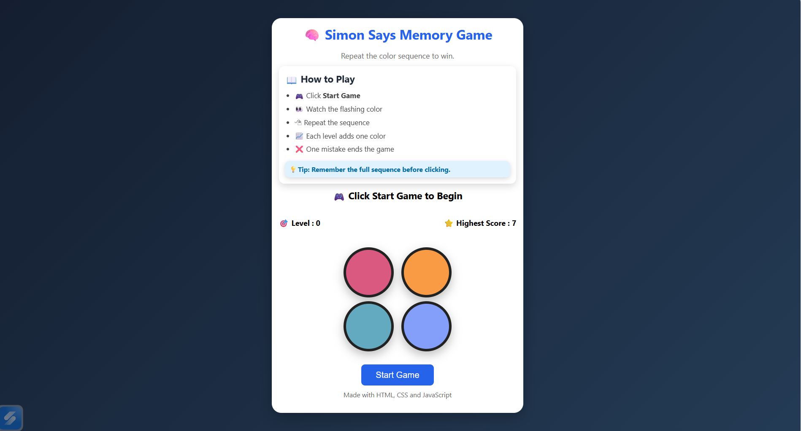
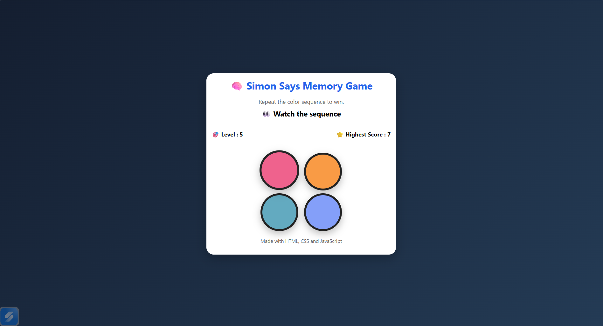
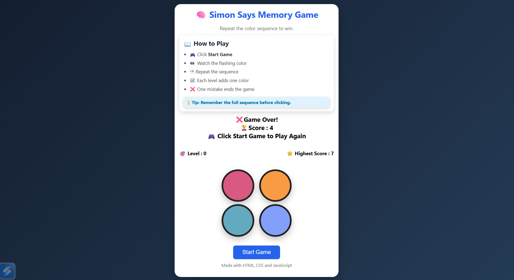

# 🧠 Simon Says Memory Game
An interactive Simon Says Memory Game built using HTML, CSS, and JavaScript with responsive design, Local Storage based High Score tracking, and smooth animations.

## 🚀 Features

* Responsive UI
* Dynamic Level Progression
* Local Storage High Score
* Smooth Animations
* Professional User Interface

## 🛠 Technologies Used

* HTML5
* CSS3
* JavaScript

## 🎮 How to Play

1. Click Start Game.
2. Watch the flashing color.
3. Repeat the sequence.
4. Every level adds one more color.
5. One wrong click ends the game.

## 📷 Screenshots

### 🏠 Home Screen

### 🎮 Gameplay

### ❌ Game Over

## 🌐 Live Demo

🎮 Play the Game Here:
https://srushtibhegade04.github.io/Simon-Says-Memory-Game/
